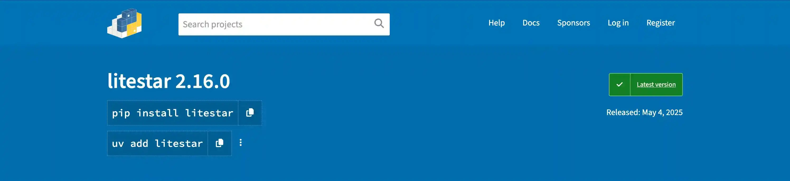

# PyPI Package Managers Extension

Add instant install commands for `uv`, `poetry`, and `pdm` directly to PyPI package pages.

> **Inspiration:** This extension is inspired by [alt-pkg](https://github.com/uncor3/alt-pkg).

- **GitHub:** [cemrehancavdar/pypi-package-managers-extension](https://github.com/cemrehancavdar/pypi-package-managers-extension)
- **Chrome Web Store:** [PyPI Package Managers](https://chromewebstore.google.com/detail/pypi-package-managers/aclonoiklbpaapakhlofnbhhofodilim)
- **Firefox Add-ons:** [PyPI Package Managers](https://addons.mozilla.org/en-US/firefox/addon/pypi-package-managers/?utm_source=addons.mozilla.org&utm_medium=referral&utm_content=search)

## Why?
Why not.

## Features
- Adds a command block to PyPI package pages for quick copying of `uv add`, `poetry add`, or `pdm add` commands.
- Remembers your preferred Python package manager.
- Supports both Chrome and Firefox browsers.

## Installation

### Chrome
1. Run the build script: `uv run build.py google`
2. Go to `chrome://extensions/` and enable Developer mode.
3. Click "Load unpacked" and select the `dist/google` folder.

### Firefox
1. Run the build script: `uv run build.py firefox`
2. Go to `about:debugging#/runtime/this-firefox`.
3. Click "Load Temporary Add-on..." and select the `dist/firefox/manifest.json` file.

## Usage
- Visit any [PyPI package page](https://pypi.org/project/).
- Use the new command block to copy install commands for your preferred tool.
- Switch between `uv`, `poetry`, and `pdm` with a single click.

## Development
1. Clone this repository.
3. Run `uv run build.py` to build both Chrome and Firefox versions.
4. Load the extension as described above.

## Contributing
Pull requests and issues are welcome! Please open an issue to discuss your idea or bug before submitting a PR.

## License
MIT License
